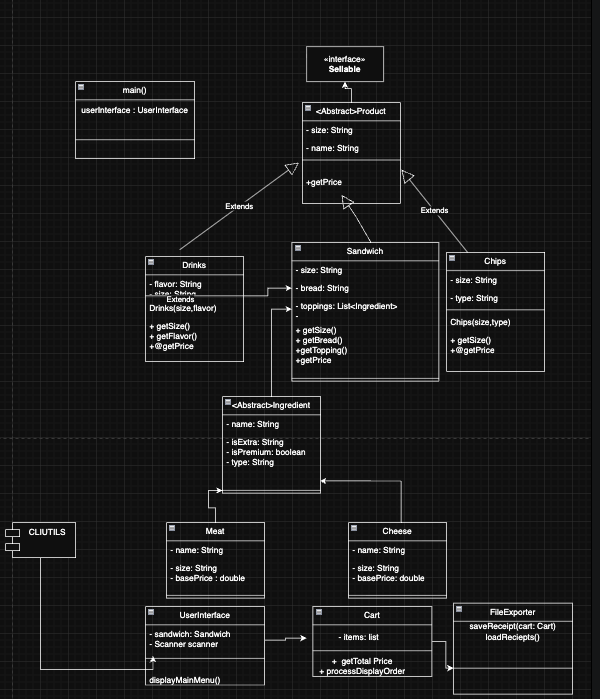
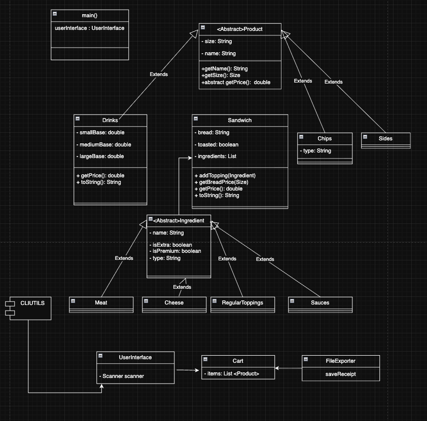
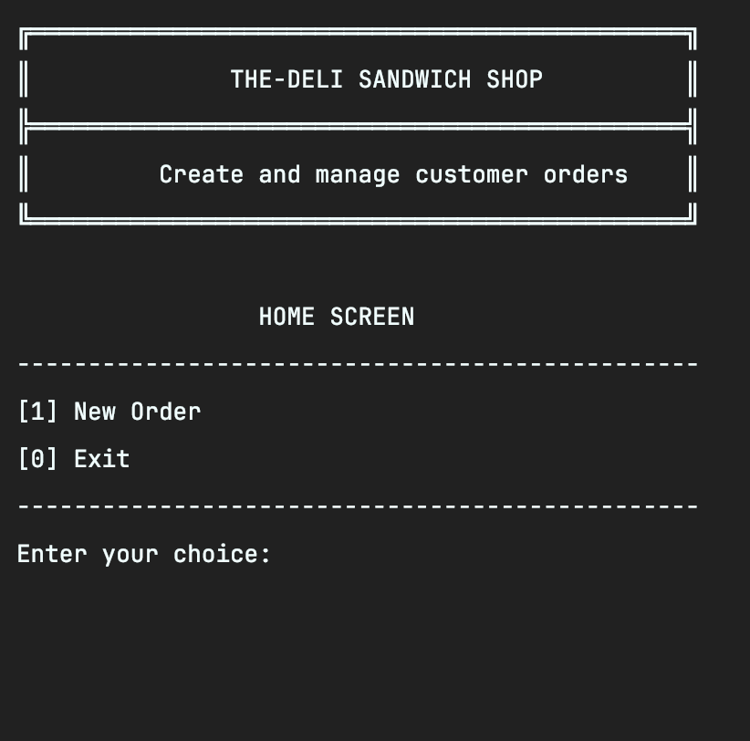
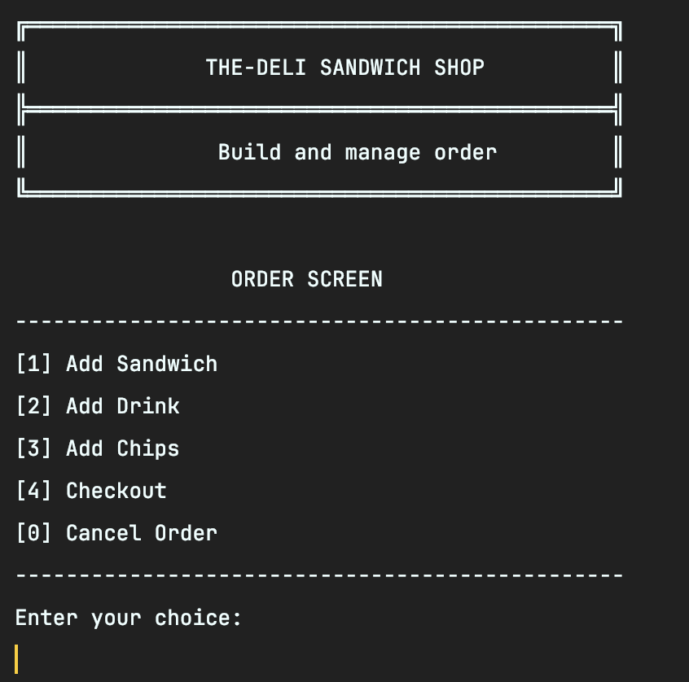
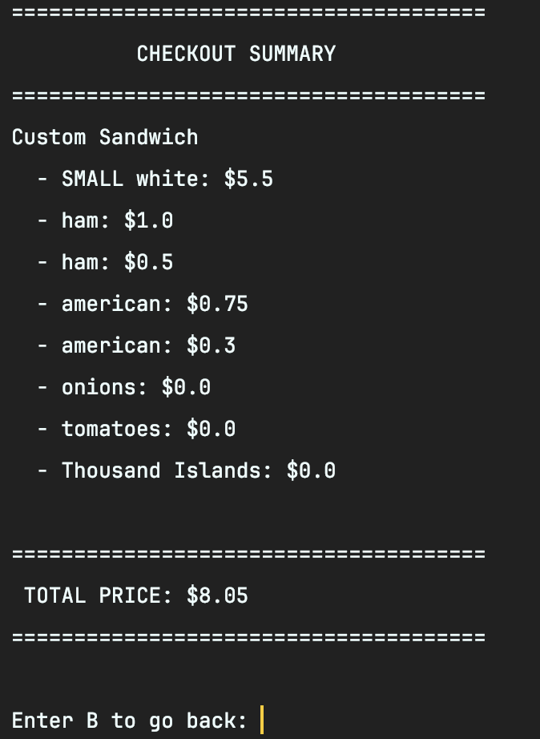
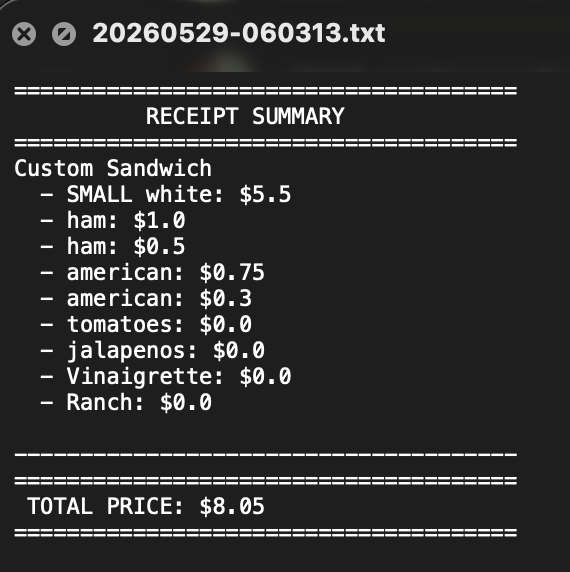

# THE-DELI Sandwich Shop Ordering System

## Overview
THE-DELI Sandwich Shop Ordering System is a Java command-line application. The program allows users to build and customize sandwich orders, pick sides and drinks, calculate the exact order total, and checkout by saving a customer receipt file.

## Features
- Customize sandwiches with choices of bread, size, meat, and cheese
- Automatically calculate extra charges for extra meat and extra cheese based on size
- Add regular toppings and sauces with built-in warnings if you try to add a duplicate
- Order chips by choosing a flavor and typing in how many bags you want
- Order self-serve fountain drinks based purely on the cup size
- Add optional sides like au jus or dipping sauce automatically
- Save finished orders to individual text receipt files with timestamps

## Technologies Used
- Java
- IntelliJ IDEA
- File I/O
- ArrayList and List
- Enums (Size, RegularTopppings)
- Inheritance and Abstract Classes
- GitHub

## How the Program Works
When the application starts, the user sees a home screen with options to start a new order or exit the program.

The order screen allows the user to:
- Add a customized sandwich (choose bread, size, meats, cheeses, vegetable toppings, and sauces)
- Automatically get side options (au jus and sauce) right after making a sandwich
- Add chips (pick a flavor and type in the quantity)
- Add fountain drinks (pick a size and type in the quantity)
- Checkout and review the full order
- Cancel the order to clear out the current cart

The checkout section allows the user to:
- See a list of all items in the cart with their names and individual prices
- See the final total price of the entire order
- Confirm the purchase, which saves the receipt file and clears the cart

## Project Structure
- `Main.java` - the entry point that runs the program
- `UserInterface.java` - handles all the console screens, menus, and user interactions
- `CliUtils.java` - utility class that handles reading keyboard input and validating numbers
- `Product.java` - the base abstract class that all store items inherit from
- `Sandwich.java` - subclass representing a sandwich, holding bread types and ingredient lists
- `Chips.java` - subclass for chips that tracks flavor data
- `Drinks.java` - subclass for fountain drinks that handles pricing based on cup size
- `Sides.java` - subclass for extra items like au jus and dipping sauces
- `Ingredient.java` - abstract class used as a blueprint for all sandwich toppings
- `Meat.java` - subclass for meats that stores base prices and extra portion prices
- `Cheese.java` - subclass for cheeses that stores base prices and extra portion prices
- `RegularToppings.java` - subclass for standard toppings like lettuce, tomatoes, and basic sauces
- `Sauces.java` - subclass specifically for sandwich condiments
- `Size.java` - enum for item sizes (`SMALL`, `MEDIUM`, `LARGE`, `NONE`)
- `RegularTopppings.java` - enum that lists the standard vegetable options
- `Cart.java` - holds the list of items in the current order and calculates the running total
- `FileExporter.java` - handles creating the receipts folder and writing the receipt data to files

## Class Diagram
To score high on the rubric, here is the look at how the object model evolved from the initial design phase to the final implementation:

### Initial Class Diagram

### Final Class Diagram

## Interesting Parts of the Code
This project uses solid object-oriented design to keep the code organized. By having a generic abstract `Product` class, the program can store completely different items (like a sandwich, a drink, or chips) inside a single list in the cart, and loop through them all to get prices.

The program also features:
- Loops inside `Sandwich` that check if a vegetable topping is already added. If a user tries to add it twice, it prints out a custom message: *"Yo, what's up with the lettuce? Lettuce escort you out of our sandwich shop."*
- Dynamic pricing inside `Meat` and `Cheese` where extra portion fees are automatically adjusted depending on whether the sandwich is small, medium, or large.
- Automated file naming inside `FileExporter` that uses the current date and time (like `yyyyMMdd-HHmmss.txt`) so no two receipts overwrite each other.

## Challenges
One major challenge was tracking extra toppings correctly. Making sure that choosing an extra portion added the correct premium fee to the sandwich—without messing up the base cost of the first portion—required careful conditional checking when prompting the user.

Another hurdle was making sure the ingredients knew how much to charge. Since topping prices depend entirely on the size of the sandwich, the `getPrice()` method in the ingredients had to be designed to accept the sandwich's `Size` as a parameter.

## Future Improvements
- Move the item prices out of the code entirely and load them from an external CSV or JSON file at startup
- Use the custom `Cart` class to manage items across all menus instead of passing local lists around
- Finish filling out the `Sauces` class to separate condiment logic from standard vegetable toppings
- Add automated Unit Tests to instantly verify that prices calculate perfectly for all item configurations

## Screenshots

#### Main Menu

### Order Menu

### Checkout Summary

### Saved Receipt File Output

## Author
Sheku Koroma